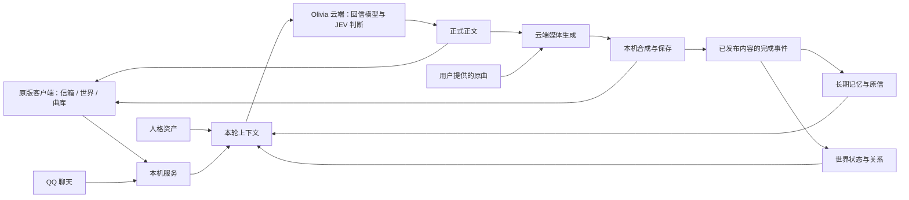

# BSide Olivia Community

<div align="center">

**把 Olivia 的写信、回信与生活延续留在你的电脑上。**

[](https://github.com/Ornn8/bside-olivia-community/actions/workflows/public-smoke.yml)
[](https://www.python.org/)
[](client/docs/WINDOWS_FULL_PATCH.md)
[](LICENSE)

[下载最新版](https://github.com/Ornn8/bside-olivia-community/releases/latest) · [安装与升级](#安装与升级) · [文档索引](client/docs/README.md) · [反馈问题](https://github.com/Ornn8/bside-olivia-community/issues)

</div>

BSide Olivia Community 是面向 Windows 的非官方陪伴复刻项目。它复用用户合法取得的原版客户端，在隔离副本中接入本机后端，保留写信、等待和回信体验，并加入长期记忆、林离世界、QQ 聊天、语音、照片与歌曲。

**信件和记忆在本机，生成在云端。** 信件、长期记忆数据库、世界记录和已生成的媒体保存在本机；文字回信、语义判断（JEV）以及语音、照片、歌曲和口型视频由 Olivia 云端服务生成，相关上下文会发送给该服务。只需要一个 Olivia 账户 Key。实时对话（Live）以后再做，不在当前版本中。

## 版本

| 版本 | 状态 | 说明 |
| --- | --- | --- |
| [2.0.7](https://github.com/Ornn8/bside-olivia-community/releases/tag/v2.0.7) | 当前发布版 | QQ 回复附带的设置不合规时只忽略该设置，回复照常发送；你约好的联系时间不受林离作息限制。[更新说明](client/docs/releases/v2.0.7.md) |
| [2.0.6](https://github.com/Ornn8/bside-olivia-community/releases/tag/v2.0.6) | 上一版 | 林离的坏心情不再一直延续，回信不再迁怒或攻击你；修复 Key 带空格时 QQ 和回信报“账户不可用”。[更新说明](client/docs/releases/v2.0.6.md) |
| [2.0.5](https://github.com/Ornn8/bside-olivia-community/releases/tag/v2.0.5) | 旧版 | 林离的日常不再在后台反复更新“休息”等没有变化的活动，大幅减少不聊天时的扣费。[更新说明](client/docs/releases/v2.0.5.md) |
| [2.0.4](https://github.com/Ornn8/bside-olivia-community/releases/tag/v2.0.4) | 旧版 | 修复导入的官方旧信被当作 1970 年的信，林离回忆时说“太久远了记不清”。[更新说明](client/docs/releases/v2.0.4.md) |
| [2.0.3](https://github.com/Ornn8/bside-olivia-community/releases/tag/v2.0.3) | 旧版 | 修复回忆失效导致林离编造往事，记住双方称呼；质量检查先检查后确认，回信成本更低。[更新说明](client/docs/releases/v2.0.3.md) |
| [2.0.2](https://github.com/Ornn8/bside-olivia-community/releases/tag/v2.0.2) | 旧版 | 修复长回信和长期使用后寄信失败、历史回忆失效、重复原文，余额不足明确提示，缩到托盘后可重新打开。[更新说明](client/docs/releases/v2.0.2.md) |
| [2.0.1](https://github.com/Ornn8/bside-olivia-community/releases/tag/v2.0.1) | 旧版 | 修复 1.x 升级用户寄信失败、“给我看看”被误判为视频、随信照片光线与场景不符，账单写明每次最低 ¥0.01。[更新说明](client/docs/releases/v2.0.1.md) |
| [2.0.0](https://github.com/Ornn8/bside-olivia-community/releases/tag/v2.0.0) | 旧版 | 世界连续性、持续情绪、JEV 云端判断、QQ 与主动联系改进、新开机动画；只保留 Olivia 账户 Key，移除自填大模型和 GPU 服务配置。[更新说明](client/docs/releases/v2.0.0.md) |
| [1.3.14](https://github.com/Ornn8/bside-olivia-community/releases/tag/v1.3.14) | 旧版 | QQ 语音优先调度，照片与语音不再排队等待共用媒体锁，修复长视频因累计等待超时失败。[更新说明](client/docs/releases/v1.3.14.md) |

各版附件、升级方式和已知问题以对应更新说明为准。

## 安装与升级

需要 Windows 10/11 x64、合法取得的原版客户端 `0.0.9.627`，以及 Olivia 账户 Key。生成都在云端完成，不要求独立显卡。

前往 [GitHub 最新发行](https://github.com/Ornn8/bside-olivia-community/releases/latest)，按用途选择：

| 你的情况 | 下载与操作 |
| --- | --- |
| 首次安装 | 下载 `Olivia-<版本>-Setup-x64.exe`，运行后选择正版 Steam 游戏目录。安装器创建隔离副本，不修改正版目录。 |
| 已有可用的 Olivia | 下载 `Olivia-<版本>.oliviapatch`，在“本地陪伴 → 补丁更新”中选择补丁，自动联网校验并安装，完成后完全退出并重新打开程序。 |
| 核对下载文件 | `.sha256` 是校验文件，不是安装组件；补丁文件校验值与 Manifest 校验值不要混用。 |

安装器包含固定版本的核心 Python 运行环境和 FFmpeg（用于在本机合成最终视频）。长期记忆等可选模型在登录后的初始设置中按需安装，也可在本地能力设置中导入对应离线包；升级保留信件、记忆、Key 和已有组件，无需重新导入记忆包。

详细步骤见 [Windows 安装、升级与回滚](client/docs/WINDOWS_FULL_PATCH.md)。安装失败时请保留日志和诊断信息，通过 [Issues](https://github.com/Ornn8/bside-olivia-community/issues) 反馈，勿附 Olivia Key 或未经处理的私人信件。

### Olivia 账户 Key

在设置的“回信服务 → Olivia 账户”中获取 Key，或导入已有的 Key；余额和消费记录也在这里查看与充值。同一个 Key 用于文字回信、JEV 判断、记忆整理，以及语音、照片、歌曲和视频生成。

Key 由当前 Windows 用户通过 DPAPI 加密保存，解密值只在本机后端使用，不写入日志或页面。

从 2.0.0 起不再支持 DeepSeek、OpenCode Go、阿里云百炼等自填大模型接口，也不再支持自填 GPU 生成服务地址。升级后旧的自填配置会被忽略，请改用 Olivia 账户 Key；本机已保存 Olivia 账户 Key 的用户，从 2.0.1 起启动时会自动用它连接回信服务。长期记忆组件仍在本机安装和配置。

## 可以做什么

### 写信与媒体回信

写信窗口提供普通信件与翻唱入口。正文由同一条人格、记忆和世界上下文链路生成，语音、照片与视频再从正式正文派生。思考内容不会作为正文或记忆。

媒体回复支持“说话”“唱歌”“说话＋唱歌”，并可选择是否生成视频。音频可在信箱内播放、查看波形和拖动进度。媒体失败时保留文字回信；混合回复中已单独发出的语音可以先听，歌曲可另行重试。

### 翻唱与曲库

在翻唱入口提供原曲音频，确认自动识别的歌词或手动补充后寄出。翻唱使用 ACE-Step 1.5 XL 与林离音色 LoRA；原曲是翻唱的必要输入。原创歌曲使用云端音乐服务生成。

翻唱完成后出现在信箱中，也可收藏到曲库。音色、旋律保留程度与耗时会受原曲和参数影响，不保证每首歌效果一致。

### QQ 聊天与主动联系

绑定 QQ 后可以在 QQ 上和林离聊天，文字、语音和照片共享与信件相同的人格、记忆和世界依据。她会结合关系、近期交流和生活事件主动联系你，并尊重暂停联系、待回复和冷却限制。

### 林离世界

“世界”是位于“信箱”和“曲库”之间的独立主页面，分开展示今天的安排、牵挂与关系和生活记录，并标出当前活动、地点、更新时间与状态依据。

她的生活按实际时间延续：课程、用餐、作息、疲劳与已有事项会影响当下安排，情绪有持续的状态和变化原因。课表是计划，不等于已经出席；没有记录也不等于没发生。关系状态与日常情绪分开，用户的示好、提问或玩笑不自动确立关系。

正常日常补充、调侃和轻微情绪变化属于角色表达；人格核心、已经确认的重要事实与双方约定应保持一致。设计与历史验证见 [林离世界](client/docs/LINLI_WORLD.md) 和 [生活状态的数据边界](client/docs/PRIVATE_WORLD_LIFE.md)。

### 记忆与媒体完成记录

Mem0 保存与后续交流有关的长期事实，近期原信与回信提供可回溯的上下文；数据按用户隔离。旧说法与后续更正保持关联，避免只找回旧结论。

已发布的语音、照片、翻唱或歌曲会以结构化完成事件关联原信，并写入世界日志，供后续回信召回。这里保存的是内容类型、来源及完成事实，音视频文件本身仍由本机媒体目录管理。

- 只记录实际完成并发布的部分；重试不重复增加同一事件。
- 歌词不等于真实经历或双方承诺，素材编号不冒充歌名。
- 世界回写暂时失败时，保留原信中的事件以便恢复。

长期 Mem0／世界提取写回仍需持续验证，不能将自动化测试等同于长期人格稳定或所有事实都能正确召回。

## 当前技术与运行方式



| 模块 | 当前职责 |
| --- | --- |
| 本机服务 | Python 3.12、aiohttp、后台任务、持久化与恢复、最终视频合成（FFmpeg） |
| 回信模型 | Olivia 云端回信服务（OpenAI 兼容协议，`qwen3.7-flash`），推理内容与最终正文分开处理 |
| JEV 判断 | 回复意图、媒体选择、相关信息选择、世界更新、情绪与记忆提取等语义判断，结构化输出 |
| 人格 | 带来源与层级的人格资产，按当前话题选择相关部分 |
| 记忆与世界 | 本机 Mem0、离线 embedding、SQLite 生活事项与关系账本；隐藏关系数值不直接进入回信 |
| 媒体生成（云端） | 语音 Breeze TTS、翻唱 ACE-Step 1.5 XL 与林离音色 LoRA、原创歌曲、照片 Qwen Image、口型 LatentSync |
| 质量与验证 | 出处及状态边界、Schema、pytest、Windows CI、发布扫描 |

客户端视频默认通过 Collection 内的 `BaseVideo` 播放，本机媒体由 `/toy/media/` 提供；这是默认书信编排路线。Web 播放器仅作为可选的显式 `uid` 本机回退，不替代原生播放器。

媒体生成失败不能删除已发布正文，也不能因重试重复提交关系变化。历史文档中的 MiniMax、RoFormer、SoulX 方案，“说话段＋约 60 秒音乐段”的固定视频描述，以及本机 GPU 生成和自填模型接口，都属于旧链路；当前用法以本页及最新更新说明为准。

## 验证范围与发布边界

DPAPI 当前用户启动读取修复已合入。各版本在真实客户端验收的范围和结果见对应更新说明，不代表所有设备均通过；遇到安装失败仍需根据日志定位。

文字回信、世界状态和媒体编排已有模型实验及自动化回归；音色、口型、完整歌曲质量与长期记忆效果仍需实际使用验收。云端服务不可用时会显示相应状态，未确认的事件或未完成的生成不会被当作已完成。实时对话（Live）以后再做，不在当前发布范围内。

## 从源码运行与参与开发

普通用户优先使用发行版安装器。客户端源码位于 `client/`；以下开发命令均在该目录执行：

```powershell
git clone https://github.com/Ornn8/bside-olivia-community.git
cd bside-olivia-community/client
.\INSTALL.cmd
.\START.cmd
```

安装与启动脚本仍要求兼容的原版资源，源码仓库不提供这些资源。启动后在设置中获取或导入 Olivia 账户 Key。

```powershell
py -3.12 -m venv .venv
.\.venv\Scripts\Activate.ps1
python -m pip install -r requirements-dev.txt
python -m pytest -q
python baseline_hardening_scan.py --mode all
git diff --check
```

| 路径 | 内容 |
| --- | --- |
| `client/runtime/` 与 `client/` 内的 Python 入口 | 产品后端、记忆、世界、模型及媒体编排 |
| `client/linli_character/` | 可公开的人格资产及来源信息 |
| `client/installer/` | 安装、启动、配置、升级和卸载 |
| `client/contracts/` | Schema 与公开接口契约 |
| `client/tests/` | 合成测试与回归用例，不包含私人信件 |
| `client/tools/`、`client/docs/` | 工程工具、用户文档与历史验收记录 |

更多入口见 [文档索引](client/docs/README.md) 与 [仓库结构](client/docs/REPOSITORY_LAYOUT.md)。提交前请阅读 [贡献指南](CONTRIBUTING.md)、[安全政策](SECURITY.md) 和 [行为准则](CODE_OF_CONDUCT.md)。

## 贡献者

感谢 [@QiLiangaiBashan](https://github.com/QiLiangaiBashan) 贡献独立记忆迁移工具、用户说明和迁移回归测试（[PR #508](https://github.com/Ornn8/bside-olivia-community/pull/508)）。

## 隐私、版权与分发

源码仓库不包含原版程序及资源归档、私人信件、Olivia Key、用户数据库、声音参考、生成媒体或第三方模型权重。安装器包含经清单和哈希校验的核心依赖；大型模型及其他可选离线组件按各自许可证和分发范围提供。

项目自有代码及未另行标注的原创技术文档采用 [Apache License 2.0](LICENSE)。该许可证不授予原版游戏、角色、商标、官方素材、第三方模型或用户内容的权利。

本项目与原作者、发行方及相关权利方没有隶属、授权或背书关系。详细边界见 [资产与权利政策](client/ASSET_POLICY.md)、[公开仓库边界](client/docs/PUBLIC_REPOSITORY.md) 和 [第三方声明](client/THIRD_PARTY_NOTICES.md)。
